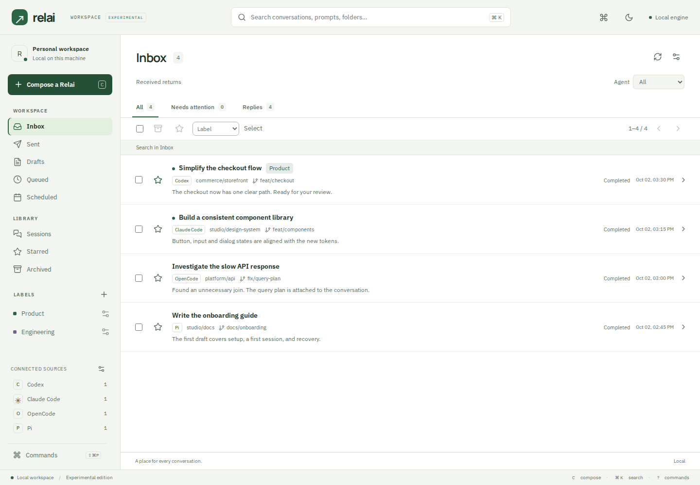
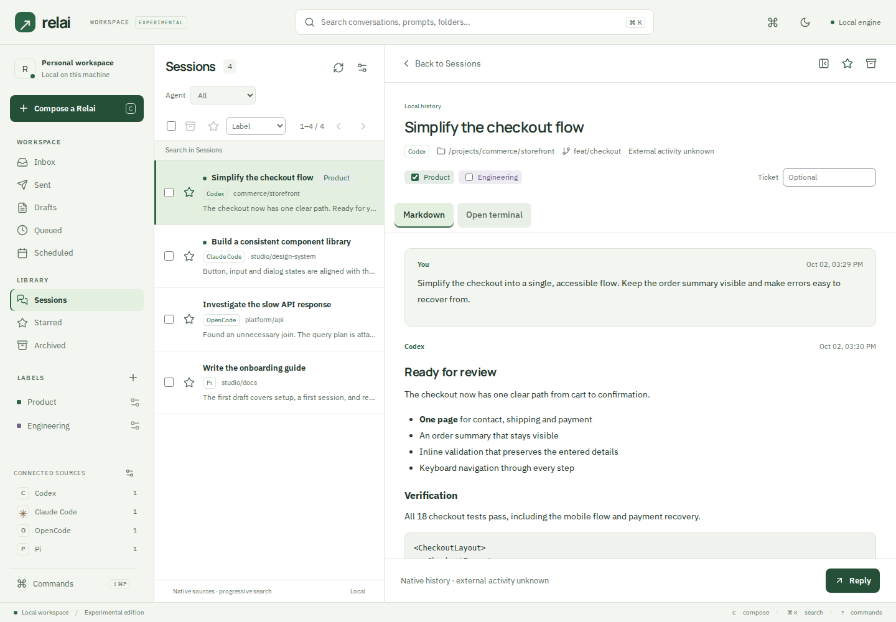

# Relai · Workspace edition

**One calm workspace for your coding agents.**

Relai brings local agent conversations into an inbox. Find a chat, prepare a prompt, review a reply, answer an approval, or open the real terminal in context. Your histories and drafts stay on your machine.

[](https://github.com/boussecsou/relai/actions/workflows/ci.yml)
[](LICENSE)

> This is the **experimental workspace edition**, developed on `experimental/relai-workspace`. The `main` branch and the original prototypes are preserved. Linux/WSL is the supported development environment.



## A place to keep work moving

- **An inbox for decisions.** Replies, questions and approvals have a home. Imported histories remain in Sessions.
- **Read without losing your place.** A conversation opens beside the list on wide screens. Focus mode gives the conversation the full workspace; smaller screens use a single pane.
- **Get anywhere quickly.** A searchable command palette, visible library navigation, keyboard shortcuts and browser Back support make common actions easy to reach.
- **Keep your context.** Mailboxes, search terms, agent filters and labels survive a reload in the URL fragment. Drafts, labels and preferences persist in SQLite.
- **See your sources.** The sidebar shows discovered history counts for each agent. Source details distinguish missing executables and partial discovery.
- **Send when it makes sense.** Codex sending supports per-conversation queues, scheduled delivery, explicit approvals and recovery states.
- **Use the native terminal.** Resume a conversation in its installed CLI, with one controlling browser tab and automatic sending paused for that chat.
- **Choose your environment.** Light and dark themes, compact density, mobile navigation and locally served fonts are included.



*Screenshots use synthetic test data. No sample conversations are inserted into your workspace.*

## Run locally

Requirements: Linux/WSL, Git, Node.js 22, npm, a C compiler, Python 3 for tests, and [Rustup](https://rust-lang.org/tools/install/). The repository pins Rust 1.99.0. Node is needed to build the frontend; the release binary embeds it.

```sh
git clone --branch experimental/relai-workspace https://github.com/boussecsou/relai.git
cd relai
npm ci --prefix apps/web
npm run build --prefix apps/web
cargo build --release --locked
RELAI_PORT=4192 RELAI_DATA_DIR=.relai-experimental-data ./target/release/relai
```

Open **http://127.0.0.1:4192**. This example uses a separate data directory and port so the experiment can run beside an existing Relai instance. New data directories start with an empty Inbox. Passive discovery may populate Sessions; browsing starts no agent.

The service binds to loopback. Keep its data directory for your drafts and organization. A harness may use a remote model provider according to its own configuration.

### Development

```sh
# Terminal 1 — build the UI once before compiling the service
npm run build --prefix apps/web
cargo run --locked

# Terminal 2 — live frontend with the API proxied to port 4179
npm run dev --prefix apps/web
```

Open http://127.0.0.1:4178. Rebuild the frontend before building a release binary. Source configuration, search syntax, native terminal behavior and delivery recovery are covered in the [operating guide](docs/running-relai.md).

### Keyboard

| Action | Shortcut |
| --- | --- |
| Compose | `C` |
| Search | `Ctrl/⌘ K` |
| Commands | `?` or `Ctrl/⌘ Shift P` |
| Reply in a conversation | `R` |
| Previous / next conversation | `K` / `J` |
| Close the current surface | `Esc` |
| Leave terminal input for its toolbar | `Ctrl Esc` |

Single-key shortcuts are disabled while editing or using the native terminal. The command palette supports arrows, Enter and Escape.

## Verify

```sh
npm ci --prefix apps/web
(cd apps/web && npx playwright install --with-deps chromium)
bash scripts/check.sh
```

This runs the credential preflight, formatting, TypeScript, frontend build, Rust formatting/Clippy/tests, the native build and eight browser/protocol suites. Tests use disposable histories and simulated harnesses. The optional `test:native` suite uses real Codex credentials and provider usage; it is excluded from the default checks and CI.

The new workspace suite covers URL restoration, browser navigation, command selection, focus recovery, split reading, both themes, 320–1920px reflow and automated axe checks. See [validation details and limits](docs/experimental-workspace.md).

## Repository map

| Path | Responsibility |
| --- | --- |
| `apps/web/src/components` | Workspace navigation, commands, empty states and rendering primitives |
| `apps/web/src/lib` | Shared API boundary, domain types, formatting and URL state |
| `apps/web/src/main.tsx` | Workspace orchestration and persistent composition |
| `apps/web/src/Messaging.tsx` | Delivery, approvals, scheduling and folder selection |
| `crates/relai/src` | Local HTTP service, SQLite, discovery and harness supervision |
| `apps/web/tests` | Browser and protocol fixtures |
| `scripts` | Reproducible checks and publication preflight |
| `docs` | Decisions, specifications, operating guide and experimental notes |
| `design` | Preserved historical prototypes; separate from the supported app |

## Current boundaries

Graphical sending supports **Codex CLI 0.159.x**. Other versions are rejected by the adapter rather than assumed compatible. Claude Code, OpenCode and Pi histories can be discovered; their installed CLIs can be opened where supported. Their graphical sending adapters remain future work.

This edition does not add cloud synchronization, Windows-native discovery, MCP, packaging or a background service installer. Closing the browser leaves work running while the local engine remains active. Run real-agent checks before relying on a new CLI version.

[Contributing](CONTRIBUTING.md) · [Security](SECURITY.md) · [Product vocabulary](CONTEXT.md) · [Architecture and decisions](docs/experimental-workspace.md)

Apache License 2.0. Bundled fonts retain their respective Open Font Licenses.
