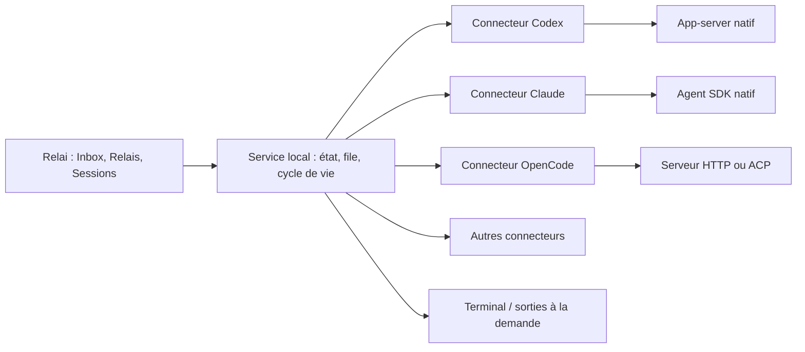

# Relai — intégration des agents et des terminaux

Recherche et propositions du **4 octobre 2026**, date utilisateur, fuseau Africa/Casablanca. Cette étude complète les recherches du dépôt sans modifier son application. Les interfaces natives consultées sont des sources officielles ou leur code source officiel. Les maquettes utilisent uniquement des données simulées.

## Recommandation

**Relai orchestre des sessions natives, avec un connecteur par agent. Le terminal est une vue facultative ou un mode de connexion spécifique.**

Ne pas faire du terminal la source de vérité de toute l’interface. Un écran TUI, sa couleur ou sa dernière ligne ne constituent pas un contrat de session. Le texte d’un terminal peut contenir commandes, animations et sorties de programmes sans indiquer si l’agent attend une réponse, une permission ou le réseau.

La configuration native, les skills, les règles du projet et l’authentification restent chez l’agent. Relai conserve les titres de Relais, leur rattachement à un ID natif, ses brouillons, la file des prompts et les métadonnées utiles à la navigation.

## Faits vérifiés par agent

| Agent | Interface consultée | Sessions et contrôle | Configuration et skills | Conséquence pour Relai |
| --- | --- | --- | --- | --- |
| Codex | App-server et registre officiel des requêtes | Méthodes `initialize`, `thread/list`, `thread/resume`, `turn/start` présentes dans le registre | `config/read`, `skills/list` présentes ; le moteur reste responsable de résoudre sa configuration | Connecteur natif app-server ; ne pas parser le TUI ou supposer qu’un serveur contrôle tous les Codex ouverts |
| Claude Code | Agent SDK Python officiel, types et fonctions de sessions | `resume` natif dans les options ; `list_sessions`, `get_session_info`, `get_session_messages` pour les historiques ; interaction via client SDK | `setting_sources` et `skills` dans les types actuels ; couches user/project/local et contrôle d’héritage | Connecteur SDK ; vérifier la version installée et charger explicitement le contexte souhaité ; reprise d’historique ≠ connexion à un TUI existant |
| OpenCode | Docs officielles serveur, CLI, configuration, skills et ACP | Serveur HTTP, `/session`, `/session/status`, messages, événements SSE ; TUI pouvant se connecter au serveur exposé | Configuration fusionnée avec ordre de priorité ; skills natifs et chemins compatibles `.claude` / `.agents` | Connecteur HTTP pour les sessions/serveurs existants ; ACP envisageable pour une intégration standardisée selon ses capacités |
| Pi | Documentation RPC officielle | Processus durable, commandes/événements JSONL ; `--session` et options de session documentées | Options et ressources du moteur natif ; surface exacte liée à la version | Bon candidat supplémentaire grâce au RPC ; ne pas attribuer la couverture de Pi à tous les agents |
| Gemini CLI | Documentation headless officielle | Sortie `stream-json` avec événements JSONL et métadonnées initiales de session | Configuration native ; cette revue ne valide pas une API générale de sélection de skills | Connecteur headless possible, avec capacités réduites tant que contrôle continu/reprise ne sont pas validés |
| Aider | Définition officielle des arguments CLI | `--message` / `--message-file` pour traiter un prompt puis quitter ; fichier d’historique et restauration proposés | Options natives ; surface distincte de Codex/Claude/OpenCode | Mode batch possible. Ne pas annoncer les mêmes sessions, approbations et événements live sans contrat supplémentaire |

Les lignes Pi, Gemini et Aider élargissent la comparaison ; les maquettes se concentrent sur **Codex, Claude Code et OpenCode**. Cette recherche est représentative, pas un inventaire exhaustif de tous les agents existants.

### Particularité importante de Claude

Dans les types officiels consultés, `setting_sources=None` charge les sources habituelles et `[]` active l’isolation du SDK. Les options `skills` peuvent demander tous les skills ou une sélection explicite. D’anciennes versions peuvent avoir d’autres valeurs par défaut ou ne pas exposer ces options. Il faut donc définir le comportement pour les versions réellement prises en charge, sans généraliser le comportement de la branche `main` à tous les utilisateurs.

Une sélection de skills est un filtre de contexte, pas un sandbox : la documentation du type rappelle que les fichiers restent sur disque. Relai ne doit pas présenter ce réglage comme une isolation de sécurité.

### Particularité importante d’OpenCode

La documentation dit qu’un TUI ouvre un serveur et qu’un nouveau `opencode serve` peut ouvrir **un autre** serveur. Pour une session active existante, chercher le serveur qui la détient et s’y connecter ; ne pas lancer aveuglément un serveur supplémentaire en prétendant s’attacher au premier.

## ACP : utile, sans être une solution universelle

ACP standardise des échanges entre clients et agents. La documentation officielle consultée indique un protocole stable `1`, une version négociée lors de `initialize` et des capacités optionnelles. La version d’une bibliothèque ou d’un schéma ne remplace pas cette négociation.

OpenCode documente `opencode acp` en JSON-RPC sur stdio. Il signale aussi des commandes intégrées actuellement non prises en charge, notamment `/undo` et `/redo`. Une connexion ACP ne justifie donc pas d’afficher toutes les commandes natives.

**Approche conseillée : utiliser ACP lorsqu’il couvre le besoin, garder les connecteurs natifs lorsque leurs opérations sont nécessaires.** Cette étude ne vérifie pas un endpoint ACP officiel pour chaque version de Codex et Claude. Un wrapper communautaire ajoute une dépendance et sa propre maintenance ; il ne supprime pas le problème.

MCP est une autre interface : il sert notamment à exposer des outils, ressources et prompts à des agents. La présence de MCP n’implique pas qu’on puisse contrôler le cycle de vie de toutes leurs sessions ou de leurs terminaux.

## Architecture proposée

### Interface commune courte

Le service propose quelques opérations métier : découvrir, lire l’historique, créer/reprendre une session, envoyer un prompt, observer une exécution, répondre à une question/permission, interrompre une exécution. L’adaptateur conserve les détails des commandes, transports et erreurs de son agent.

Le contrat doit distinguer les capacités suivantes :

- Historique découvrable et lisible.
- Nouvelle session et reprise avec le même identifiant natif.
- Observation live réellement disponible.
- Envoi à une session active réellement disponible.
- Questions et approbations natives avec leurs identifiants.
- Interruption d’un tour et arrêt d’un processus : deux actions séparées.
- Terminal détenu par Relai, terminal natif attachable ou simple sortie de commande.
- Catalogue/modification de modèle, configuration et skills, lorsque pris en charge.

Ces capacités sont **définies par le connecteur et vérifiées**. Certains protocoles annoncent des capacités ; d’autres nécessitent une table par version et des contrôles non destructifs. Il ne faut pas inventer un endpoint universel de négociation.

### Identité et propriété de la session

Une clé comprend agent, environnement, profil/store et ID natif. Un même nom de session dans Windows, WSL ou deux dossiers de configuration ne doit pas créer un faux doublon.

Conserver séparément :

1. Présence d’un historique.
2. Exécutable disponible.
3. État d’activité observé, source et date.
4. Canal de contrôle établi.
5. Propriétaire du processus ou du serveur.

Le service garantit un seul dispatcher pour une session qu’il contrôle. Il ne peut pas garantir qu’aucun terminal externe travaille sur un historique en l’absence de signal natif. Dans ce cas : **Activity unknown**, contrôle indisponible et récupération explicite. Ne pas lancer silencieusement un concurrent.

### File et arrêt

Le service local vit indépendamment de l’onglet navigateur. Un prompt vers une session occupée est mis en file selon une règle explicite. La file doit être persistée avant d’annoncer l’enregistrement, avec états enregistrés/acceptés/terminés distincts.

Sans déduplication garantie par l’agent, une panne entre envoi et accusé peut laisser une livraison incertaine. Relai doit la montrer avant de relancer ; il ne doit pas promettre une exécution exactement une fois.

Fermer le panneau terminal ne termine pas le processus. Interrompre un tour ne supprime pas la session. Quitter le service ou éteindre la machine relève d’un cycle de vie différent.

## Comment intégrer le terminal

### A. Mode structuré recommandé

Le connecteur reçoit réponses, événements, outils et permissions via l’interface native. Relai construit la conversation à partir de ces événements ; les sorties de commandes sont consultables à part.

Un affichage de sortie Bash n’est pas le TUI complet de l’agent. Le libellé doit être **Command output** lorsque Relai ne possède pas un vrai terminal interactif.

### B. Terminal natif attachable

Lorsque l’agent permet de connecter un TUI au même moteur, ouvrir une vue native sans créer un second moteur. Le cas OpenCode est documenté, sous réserve de l’adresse, du serveur et des capacités installées.

### C. Mode terminal détenu par Relai

Pour un agent sans interface structurée suffisante, Relai peut lancer lui-même un PTY : `portable-pty` ou une solution équivalente côté service, ConPTY sous Windows, et un émulateur comme xterm.js côté navigateur. Ces outils sont des **options d’implémentation**, pas des dépendances de ces maquettes ni une intégration vérifiée ici.

Dans ce mode, afficher une couverture réduite : l’historique et les approbations ne deviennent pas fiables par simple lecture ANSI. Ne pas piloter un terminal indépendant par simulation de frappes ou analyse de ses animations.

Charger le terminal à la demande. Lire ses sorties en permanence côté service, avec buffers bornés, rétention des logs et politique de saturation. Plusieurs milliers de lignes ne doivent pas faire re-rendre toute la conversation.

### D. Handoff vers le mode natif

S’il faut reprendre via un nouveau processus natif, utiliser une transition explicite et une vérification de propriété. Ne pas faire tourner simultanément un SDK et un CLI sur le même historique. Les adaptations concrètes sont à tester par agent ; les maquettes ne promettent pas un handoff universel.

## Configuration : un profil par agent, sans refaire son application

**Par défaut : Inherit native configuration.** Garder le cwd, les règles du projet, le home/profile choisi, les permissions et l’authentification natives.

Le service respecte l’ordre de priorité du moteur. Relai ne fusionne pas un TOML Codex, un settings JSON Claude et un JSONC OpenCode avec la même fonction naïve.

Trois niveaux dans l’UI :

1. Réglages natifs utilisateur.
2. Réglages/instructions natifs du projet.
3. Exceptions Relai explicites, uniquement lorsque le connecteur peut les appliquer.

Les réglages importants peuvent être résumés avec leur provenance ; la configuration avancée reste dans le fichier ou l’application native. Les exceptions de la maquette s’appliquent aux nouvelles sessions. Un changement de fichier ne garantit pas que la session active recharge tout son contexte ; le connecteur doit indiquer quand un nouveau tour, une reprise ou une nouvelle session est nécessaire.

Relai ne doit pas importer ou afficher les fichiers de tokens pour constituer ces profils. L’authentification reste gérée par l’agent ou le service qui le lance. Ces maquettes n’accèdent à aucun fichier utilisateur.

## Skills : catalogue natif et provenance

Les agents peuvent employer des conventions proches de `SKILL.md`, mais leurs chemins, priorités, droits et mécanismes d’activation diffèrent. OpenCode documente explicitement les chemins natifs et les répertoires compatibles Claude/agents.

Dans Relai, montrer nom, description, portée, source et état : **discovered**, **available**, **loaded/used** lorsqu’un événement le prouve. Ne pas confondre un fichier trouvé avec un skill utilisé pendant une exécution.

Activer/désactiver depuis l’UI seulement lorsqu’une option native vérifiée existe. Sinon, afficher **Inherited** avec accès à la configuration native. Une désactivation uniforme imaginaire serait trompeuse.

Ne pas recopier les skills dans un nouveau dossier Relai par défaut. Cela provoquerait doublons, divergence et mises à jour difficiles. Un format commun éventuel est utile comme interchange, pas comme garantie universelle d’exécution.

## Une mise à jour d’agent impose-t-elle une mise à jour de Relai ?

**Non, pas systématiquement. Oui, parfois.**

| Évolution | Traitement attendu |
| --- | --- |
| Nouveau modèle ou skill dans un catalogue stable | Découverte dynamique ; souvent aucun changement Relai |
| Champ supplémentaire dans une réponse compatible | Tolérer les champs inconnus ; conserver le résultat utile |
| Nouvelle option native facultative | Ne pas l’exposer avant validation ; l’interface existante peut continuer |
| Version de schéma/artifact changée, protocole inchangé | Refaire les vérifications de compatibilité ; pas de rupture à supposer |
| Méthode retirée, format modifié, nouvelle règle de reprise | Mettre à jour le connecteur concerné et ses tests ; une livraison Relai peut être nécessaire |
| Format d’un fichier interne changé | Raison supplémentaire de privilégier l’API native plutôt qu’un parseur figé |
| Runtime non compatible | Historique et brouillons restent accessibles ; désactiver seulement le contrôle touché |

Réduire la maintenance avec interfaces natives, versions prises en charge documentées, tests de contrat, opérations optionnelles et erreurs isolées. **Aucun protocole ne garantit une compatibilité éternelle.**

Commencer par des modules internes distincts. Pas besoin d’une plateforme de plugins ou d’un bus universel dès le départ. Si les correctifs de connecteurs doivent ensuite être livrés indépendamment, prévoir des paquets versionnés avec intégrité vérifiée et un canal de confiance. Un manifeste déclaratif peut préciser commandes, versions et capacités ; il ne sait pas à lui seul gérer toutes les différences comportementales.

## Proposition UI recommandée

- Composer inchangé : session existante ou agent + dossier, titre et prompt.
- Panneau Session facultatif : Overview, Activity, Terminal/Command output selon la connexion.
- Couleur et nom de l’agent toujours visibles ; détails avancés hors du formulaire principal.
- Un état de connexion et une action adaptée : Connected/Open, Saved/Resume, Needs connection/Connect, Unknown/Check.
- Settings par agent : configuration héritée, skills/provenance, compatibilité à la demande.
- Informations d’architecture regroupées dans cette étude, pas imposées à chaque prompt.

## Parcours à valider avant intégration réelle

1. Codex : démarrer un app-server contrôlé, lister/reprendre un thread et recevoir les événements/approbations.
2. Claude : vérifier réglages, CLAUDE.md et skills dans le SDK installé, conserver l’ID natif après reprise, tester un historique avec TUI externe.
3. OpenCode : se connecter à un serveur existant, observer son statut, envoyer à la bonne session et partager avec un TUI ; comparer HTTP et ACP.
4. Exécuter la même suite sur versions officiellement prises en charge, Windows/WSL séparément, stores personnalisés et dossiers déplacés.
5. Tester état inconnu, doublon de nom, agent désinstallé, protocole incompatible, perte de connexion, permission et envoi incertain.
6. Vérifier ressources, logs et files avec plusieurs sessions ; publier des mesures uniquement après exécution réelle.

Les tests actuels concernent **les maquettes HTML**, pas des intégrations de ces SDK/serveurs. Aucun agent n’a été lancé pour cette étude.

## Sources consultées

Les snapshots et leurs statuts sont dans `research/sources.json`. Les branches `main`/`dev` sont mouvantes ; cette consultation ne constitue pas une matrice de compatibilité avec des versions installées.

- [Codex : registre des requêtes app-server](https://github.com/openai/codex/blob/main/codex-rs/app-server-protocol/src/protocol/common.rs)
- [Codex : app-server et ses évolutions](https://github.com/openai/codex/blob/main/codex-rs/app-server/README.md)
- [Codex : documentation de configuration](https://github.com/openai/codex/blob/main/docs/config.md)
- [Claude Agent SDK : guide officiel](https://github.com/anthropics/claude-agent-sdk-python/blob/main/README.md)
- [Claude : options, sources et skills](https://github.com/anthropics/claude-agent-sdk-python/blob/main/src/claude_agent_sdk/types.py)
- [Claude : découverte/lecture de sessions](https://github.com/anthropics/claude-agent-sdk-python/blob/main/src/claude_agent_sdk/_internal/sessions.py)
- [OpenCode : serveur](https://github.com/anomalyco/opencode/blob/dev/packages/web/src/content/docs/server.mdx)
- [OpenCode : CLI](https://github.com/anomalyco/opencode/blob/dev/packages/web/src/content/docs/cli.mdx)
- [OpenCode : configuration](https://github.com/anomalyco/opencode/blob/dev/packages/web/src/content/docs/config.mdx)
- [OpenCode : skills](https://github.com/anomalyco/opencode/blob/dev/packages/web/src/content/docs/skills.mdx)
- [OpenCode : ACP](https://github.com/anomalyco/opencode/blob/dev/packages/web/src/content/docs/acp.mdx)
- [ACP : protocole et versionnement](https://github.com/agentclientprotocol/agent-client-protocol/blob/main/README.md)
- [Pi : RPC](https://github.com/badlogic/pi-mono/blob/main/packages/coding-agent/docs/rpc.md)
- [Gemini CLI : headless](https://github.com/google-gemini/gemini-cli/blob/main/docs/cli/headless.md)
- [Aider : arguments CLI](https://github.com/Aider-AI/aider/blob/main/aider/args.py)

Les tentatives de lecture de `v2.rs` Codex et de l’ancien chemin de son skills loader ont retourné 404. Aucune affirmation ne repose sur leur contenu indisponible. La spécification IDE Gemini lue décrit une intégration compagnon ; elle n’est pas présentée comme une preuve d’ACP.
